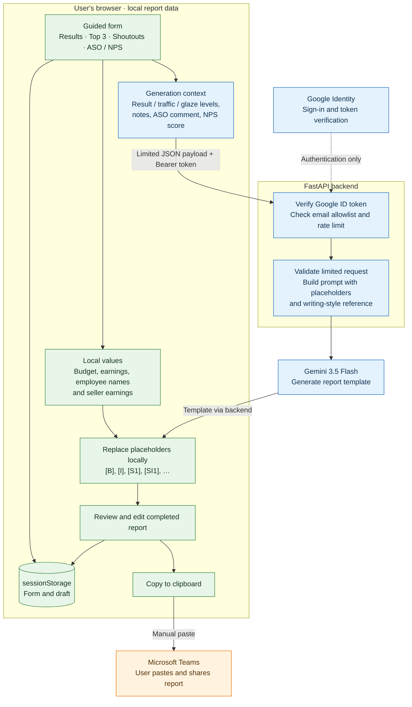

# Dagens tall

Dagens tall turns a store's daily results into an editable, Microsoft Teams-ready report in Norwegian Bokmål. A guided form collects daily results, the top three sellers, optional shoutouts, and ASO (After Sales Operations) and NPS context. Users choose the result mood, customer traffic, and how enthusiastic the writing should be (the “glaze” level).

**Actual budget figures, earnings, and employee names entered in dedicated fields stay in the user's browser.** Gemini generates a template with placeholders; the browser inserts the sensitive values afterwards. Users review and copy the completed report locally before sharing it.

This is an online application with a limited AI payload. Optional notes, ASO comments, and NPS scores are sent to the backend and Gemini. Free text is not automatically anonymized, so those fields must contain only information appropriate to send externally.

## Report pipeline



1. **Enter results.** The browser calculates the difference against budget and formats currency locally. The result mood is selected separately; it is not automatically derived from the financial figures.
2. **Add people and context.** Enter three sellers and optionally add notable sales, shoutouts, an ASO comment, and an NPS score.
3. **Choose the tone.** Result, traffic, and glaze each use a level from 1 to 5.
4. **Generate a template.** The frontend submits the selected levels, notes with numbered slots, ASO comment, and NPS score. FastAPI authenticates the user, validates the request, applies the generation limit, and calls Gemini with system instructions and a writing-style reference.
5. **Insert sensitive values locally.** The browser replaces tokens such as `[B]`, `[I]`, `[AVVIK]`, `[S1]`, `[SI1]`, and `[SHOUTOUT1_NAVN]` using local form values. Unknown or unresolved tokens remain visible with a warning.
6. **Review and share.** Edit the draft and copy it to the clipboard. The application does not post to Teams automatically.

## Before and after: local placeholder replacement

This illustrative example uses fictional names and figures. The wording stays the same; the browser fills in the placeholders after receiving the AI template.

### Before: raw AI template

```text
Sterk innsats i dag! Vi endte med [I] mot et budsjett på [B].

Topp 3:
1. [S1] med [SI1]
2. [S2] med [SI2]
3. [S3] med [SI3]

Ekstra takk til [SHOUTOUT1_NAVN] som hjalp supportlaget i en travel periode.
```

### After: completed report in the browser

```text
Sterk innsats i dag! Vi endte med 60 000 kr mot et budsjett på 50 000 kr.

Topp 3:
1. Alex med 12 000 kr
2. Robin med 10 000 kr
3. Kim med 3 500 kr

Ekstra takk til Sam som hjalp supportlaget i en travel periode.
```

The names and financial figures above are inserted locally and are not sent back to Gemini. The generic shoutout note is part of the AI request; the employee's name is kept in its separate local field. Currency spacing may vary with browser formatting.

## Privacy and data boundaries

| Information | Handling in the current implementation |
| --- | --- |
| Daily budget, earnings, and calculated deviation | Kept in browser state and `sessionStorage`; inserted locally. Omitted from the generation request. |
| Seller names and earnings | Kept locally and substituted into `[S1]`–`[S3]` and `[SI1]`–`[SI3]`. Omitted from the generation request. |
| Shoutout names | Kept locally and substituted into numbered name tokens. Only the slot number and note are submitted. |
| Result mood, customer traffic, and glaze | Sent to FastAPI and used in Gemini's prompt. Result mood still communicates approximate business performance. |
| Notable-sale notes, shoutout notes, and ASO comment | Sent to FastAPI and Gemini as entered. Names, amounts, customer details, and other sensitive content are not automatically removed. |
| NPS score | Sent to FastAPI and Gemini as an actual numeric score when provided. |
| Completed draft and edits | Stored in browser state and `sessionStorage`. The generation request does not send the completed draft back to the backend. Copying writes it to the clipboard; pasting into Teams shares it there. |
| Google sign-in identity | Handled by Google Identity. The ID token is kept in frontend memory and sent to the backend. The verified email is used for authorization and rate limiting, but is not added to Gemini's prompt. |
| Gemini API key and email allowlist | Configured on the backend, never as frontend `VITE_*` variables. Local configuration files are excluded from Git. |

The boundary is implemented by the explicit request construction in [`src/App.tsx`](src/App.tsx) and the restricted Pydantic models in [`backend/main.py`](backend/main.py). The API has no request fields for budget, earnings, or employee names, and rejects extra fields. Placeholder replacement runs in the frontend after the template returns.

**Keep free-text notes generic.** Write “helped the support team during a busy period” in a shoutout note and put the employee's name in the separate name field. Putting names or exact financial amounts in notes sends them externally. System prompt instructions are not a redaction mechanism.

### Local storage and operational limits

- The form and draft are saved under `dagens-tall-form` in `sessionStorage`, allowing reloads to restore work. This is browser storage, not an application database or encrypted vault.
- **Signing out does not clear the saved form or draft.** It clears the in-memory authentication token. Clear the site's session storage when local data must be removed, especially on shared devices. Browser session restoration can affect how long session data remains available.
- The application has no report database or report-history service. The backend processes submitted context and maintains an in-memory rate-limit tracker by email.
- The backend logs Gemini exceptions. Hosting, proxy, and provider logging or retention are outside the browser-local boundary; this repository does not establish a zero-retention guarantee for submitted context.
- Writing examples in `backend/references.py` are included in Gemini prompts. Treat those references as externally sent content too, and use fictional examples when editing them.
- Local handling describes the intended application data flow. Browser scripts, extensions, clipboard history, and access to the user's device can still expose locally held data.

## Architecture and access control

| Component | Role |
| --- | --- |
| React + TypeScript | Guided form, local calculations, placeholder replacement, draft editing, clipboard copy. |
| Vite | Development server, local `/api` proxy, production frontend build. |
| FastAPI + Pydantic | API routing, authentication, request validation, prompt assembly. |
| Google Identity Services | Browser sign-in; backend verifies tokens against the configured client ID and requires a verified, allowlisted email. |
| Google Gen AI SDK | Server-side call to `gemini-2.5-flash`. |

Generation requires authentication and allows **six attempts per minute per email, per backend process**. The limiter resets on process restart and is not shared across workers. CORS allows the configured frontend origin and `http://localhost:5173`. Interactive API documentation is disabled in production.

The first email in `ALLOWED_EMAILS` can use the frontend's test-data controls. Other allowlisted users can generate reports normally.

## Run locally

You need Node.js/npm, Python with `venv` and `pip`, a Gemini API key, and a Google OAuth client configured as a Web application. Add `http://localhost:5173` as an authorized JavaScript origin for that client. Internet access is required for Google sign-in and Gemini generation even when both application servers run locally.

### 1. Backend

From the repository root, in PowerShell:

```powershell
Copy-Item backend/.env.example backend/.env
python -m venv backend/.venv
backend/.venv/Scripts/python.exe -m pip install -r backend/requirements.txt
```

Edit `backend/.env`:

```dotenv
GEMINI_API_KEY=your_gemini_api_key
GOOGLE_CLIENT_ID=your_google_oauth_client_id
ALLOWED_EMAILS=developer@example.com,colleague@example.com
FRONTEND_ORIGIN=http://localhost:5173
ENVIRONMENT=development
```

Start the API:

```powershell
Set-Location backend
.venv/Scripts/python.exe -m uvicorn main:app --reload --host 127.0.0.1 --port 8000
```

### 2. Frontend

In a second terminal, from the repository root:

```powershell
Copy-Item .env.local.example .env.local
npm ci
```

Set `VITE_GOOGLE_CLIENT_ID` in `.env.local` to the same client ID as the backend. Leave `VITE_API_URL` empty locally so Vite proxies `/api` to `http://127.0.0.1:8000`.

```powershell
npm run dev
```

Open `http://localhost:5173` and sign in with an allowlisted account. `GET /api/health` is public; `GET /api/session` and `POST /api/generate-daily-report` require a Bearer ID token. Development API documentation is at `http://127.0.0.1:8000/docs`.

### 3. Check and build

```powershell
npm run lint
npm run build
```

The build runs TypeScript checks and creates frontend assets in `dist/`. `npm run preview` serves those assets locally; configure `VITE_API_URL` before building if the preview needs a backend, since the `/api` proxy is configured for the development server.

## Deployment and configuration hygiene

See [`DEPLOYMENT.md`](DEPLOYMENT.md) for Render setup. A hosted backend receives the limited generation context described above; placeholder replacement continues in the user's browser.

- Keep the Gemini API key and email allowlist in backend environment variables.
- Frontend `VITE_*` values are public build configuration. Use them for the Google client ID and API URL, never for API secrets.
- `.gitignore` excludes `backend/.env`, `*.local`, `backend/.venv/`, backend Python caches, `node_modules/`, and build output. Commit blank example configuration files instead of real credentials.
- Ignore rules do not remove files already tracked by Git. Review staged changes for credentials, personal data, and real business examples before committing.
- Set `ENVIRONMENT=production` and the exact `FRONTEND_ORIGIN` for hosted deployments, and serve them over HTTPS.

## Repository guide

```text
src/App.tsx               Form, sign-in, request payload, local token replacement
src/App.css               Application layout and styling
src/index.css             Global styles
src/google-identity.d.ts  Google Identity browser type declarations
backend/main.py           API, authentication, validation, rate limit, Gemini call
backend/prompt.py         System instructions and allowed placeholders
backend/references.py     Writing examples for each glaze level
backend/requirements.txt  Python dependencies
backend/.env.example      Blank backend configuration template
.env.local.example        Blank frontend configuration template
vite.config.ts            React plugin and local API proxy
DEPLOYMENT.md             Render publishing instructions
```
